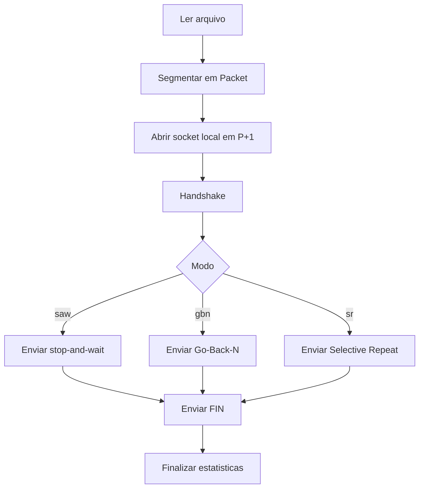
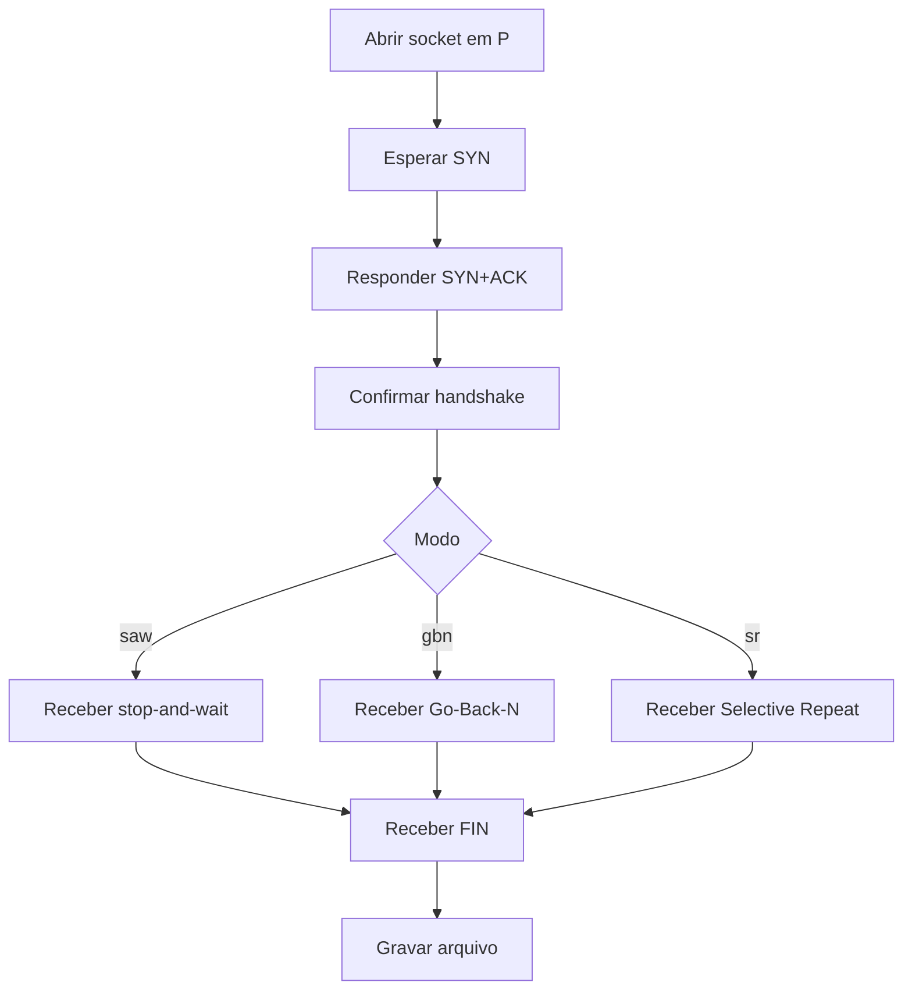
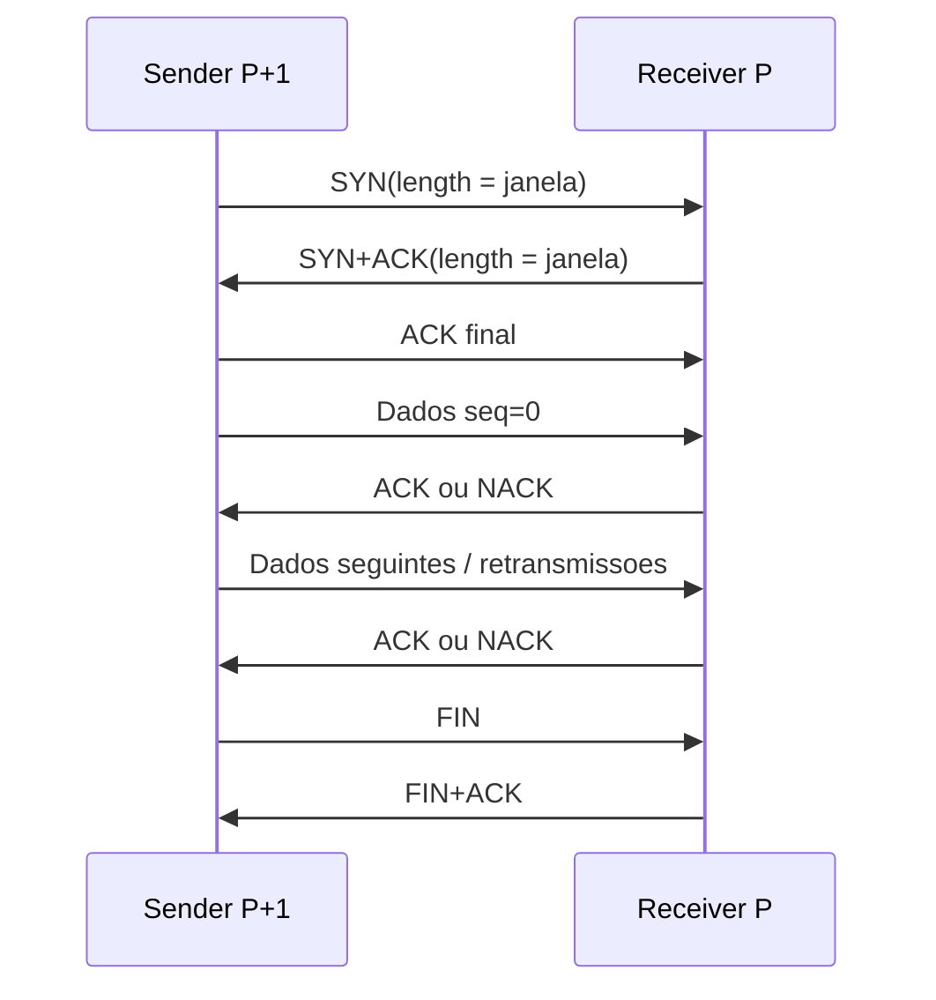

# Apresentacao Tecnica - Implementacao do RTP

## Objetivo desta apresentacao

Este arquivo serve como roteiro de apresentacao do codigo para o professor, com foco maior na implementacao do protocolo do que nos resultados experimentais.

A ideia e explicar:

- como o projeto esta organizado;
- como os dados entram e saem do sistema;
- quais sao as funcoes mais importantes;
- como o handshake, a transferencia e o encerramento funcionam;
- o que muda entre `saw`, `gbn` e `sr`.

## 1. Visao geral do projeto

O projeto implementa um protocolo confiavel sobre UDP com tres modos:

- `saw`: stop-and-wait;
- `gbn`: Go-Back-N;
- `sr`: Selective Repeat.

A organizacao principal do codigo e:

- `src/rtp/__main__.py`: entrada da aplicacao e parse da CLI;
- `src/rtp/protocol.py`: formato do protocolo e operacoes de pacote;
- `src/rtp/peer.py`: implementacao do sender e do receiver;
- `tests/`: testes unitarios e de integracao.

A explicacao da apresentacao pode seguir exatamente essa ordem.

## 2. Comecando pela entrada do programa

### Arquivo principal: `__main__.py`

A primeira ideia importante para explicar e que esse arquivo foi mantido pequeno de proposito.

Ele faz quatro coisas:

1. monta o parser de argumentos;
2. valida porta e tamanho de janela;
3. decide se o processo vai rodar como sender ou receiver;
4. instancia `RtpSender` ou `RtpReceiver`.

### Funcoes importantes

#### `build_parser()`

Essa funcao define a interface da aplicacao:

- `--listen` define modo receiver;
- `--host` indica o host remoto do receiver quando estamos em modo sender;
- `--bind-host` define em qual interface local o socket sera aberto;
- `--port` define a porta base `P` da especificacao;
- `--mode` escolhe `saw`, `gbn` ou `sr`;
- `--window` define a janela proposta no handshake;
- `--input` e `--output` controlam os arquivos.

#### `main()`

Essa funcao faz o roteamento da execucao:

- se `--listen` foi passado, cria `RtpReceiver`;
- senao, cria `RtpSender`.

Ou seja, a CLI nao implementa comportamento de rede. Ela so encaminha para a classe certa.

## 3. O formato do protocolo

### Arquivo principal: `protocol.py`

Esse arquivo contem a parte mais "matematica" do projeto: como um pacote RTP existe no fio.

A explicacao aqui deve mostrar que a implementacao separa duas coisas:

- o formato dos dados;
- a logica de transmissao.

Isso deixa o projeto mais facil de manter e testar.

## 4. Estrutura do cabecalho

A classe `Header` representa o cabecalho RTP.

Campos:

- `seq`: numero de sequencia de 14 bits;
- `syn`: bit de handshake;
- `fin`: bit de encerramento;
- `ack`: numero de acknowledgement de 14 bits;
- `ack_flag`: diz se o campo `ack` e valido;
- `nack`: indica negative acknowledgement;
- `length`: tamanho do payload ou janela durante handshake;
- `crc32`: checksum.

### Funcao importante: `Header.pack()`

Essa funcao transforma o cabecalho em 9 bytes.

Ideia principal para explicar:

- cada campo ocupa uma faixa exata de bits;
- a serializacao e feita com shift e OR bit a bit;
- no final, tudo vira um inteiro de 72 bits convertido para bytes em big-endian.

Isso mostra que o grupo nao usou um formato improvisado: o layout do cabecalho foi implementado de forma deterministica.

### Funcao importante: `Header.unpack()`

Faz o caminho inverso:

- recebe 9 bytes;
- interpreta como inteiro;
- extrai cada campo usando shift e mascara.

## 5. Representacao do pacote completo

A classe `Packet` representa um datagrama RTP inteiro:

- `header`;
- `payload`.

### Funcao importante: `Packet.to_bytes()`

Essa funcao e central no envio.

Passo a passo:

1. valida se o pacote faz sentido;
2. garante que pacote de handshake nao carrega payload;
3. garante que o `length` bate com o tamanho real do payload;
4. monta uma copia do cabecalho com `crc32 = 0`;
5. calcula o CRC32 sobre cabecalho mais payload;
6. grava o checksum final;
7. concatena cabecalho e payload.

### Funcao importante: `Packet.parse()`

Essa funcao e central na recepcao.

Passo a passo:

1. verifica se o datagrama tem tamanho minimo;
2. extrai o cabecalho;
3. calcula o tamanho esperado do payload;
4. confere se o datagrama recebido bate com esse tamanho;
5. recalcula o CRC32;
6. se o checksum falhar, retorna `None`.

Ponto conceitual importante para a apresentacao:

- pacote corrompido nao vira excecao fatal;
- ele simplesmente e descartado;
- isso deixa a logica de retransmissao concentrada no timeout do protocolo.

## 6. Helpers de sequencia e janela

Ainda em `protocol.py`, temos varias funcoes auxiliares para trabalhar com o espaco de sequencia modular de 14 bits.

### Funcoes mais importantes

#### `seq_add(seq, increment)`

Soma modular. Serve para avancar no espaco de sequencia sem quebrar no wrap-around.

#### `seq_prev(seq)`

Retorna o pacote anterior no anel de sequencia.

#### `seq_in_window(seq, start, size)`

Pergunta se um `seq` esta dentro da janela atual.

#### `seq_is_recent(seq, current, size)`

Ajuda a decidir se um pacote pertence ao passado recente, o que e importante para tratar duplicatas.

### Por que isso importa

Esses helpers evitam espalhar conta modular por todo o codigo de rede. Isso torna `peer.py` muito mais legivel.

## 7. Como os dados sao divididos antes de enviar

### Funcao importante: `build_data_packets(data)`

Essa funcao recebe o arquivo completo em bytes e quebra em varios pacotes RTP.

Regras implementadas:

- payload normal de ate 255 bytes;
- se o ultimo bloco for menor que 255, esse ja e o ultimo pacote;
- se o arquivo for multiplo exato de 255, um pacote extra com `length = 0` e criado;
- se o arquivo estiver vazio, tambem existe um pacote final de tamanho zero.

Esse detalhe e importante para explicar porque o receiver consegue saber que o stream terminou, mesmo quando o tamanho total cai exatamente na fronteira de 255 bytes.

## 8. Onde fica a logica do protocolo

### Arquivo principal: `peer.py`

Esse e o arquivo mais importante da implementacao.

Ele contem:

- criacao dos sockets;
- estrutura de estatisticas;
- classe `RtpSender`;
- classe `RtpReceiver`;
- handshake;
- envio e recebimento de dados;
- timeout e retransmissao;
- encerramento da sessao.

Se o professor perguntar "onde realmente esta o protocolo?", a resposta principal e: `peer.py`.

## 9. Criacao dos sockets e modelo de portas

### Funcoes importantes

#### `create_bound_socket(bind_host, port, timeout)`

Abre o socket do receiver e faz `bind` exatamente na porta `P`.

#### `create_sender_socket(bind_host, port, timeout)`

Abre o socket do sender e faz `bind` em `P+1`.

Isso implementa diretamente a regra da especificacao:

- receiver escuta em `P`;
- sender usa `P+1` como porta local da sessao.

Essa parte vale destaque porque foi um ponto importante para interoperabilidade.

## 10. Estatisticas da transferencia

### Classe importante: `TransferStats`

Essa classe nao implementa a confiabilidade em si, mas ajuda muito a observar o protocolo.

Ela armazena:

- bytes transferidos;
- datagramas enviados;
- datagramas recebidos;
- retransmissoes;
- tempo total;
- throughput calculado.

Na apresentacao, isso e bom para mostrar que o codigo nao so transfere, mas tambem se mede.

## 11. Fluxo geral do sender

### Classe principal: `RtpSender`

A melhor forma de apresentar essa classe e seguir a ordem do metodo `run()`.

### Funcao importante: `RtpSender.run()`

Fluxo:

1. le o arquivo inteiro da entrada;
2. chama `build_data_packets()`;
3. abre o socket local em `P+1`;
4. executa o handshake com `_establish_session()`;
5. escolhe o algoritmo de envio com base no modo;
6. encerra a sessao com `_close_session()`;
7. finaliza as estatisticas.

### Diagrama do sender

## 12. Handshake do sender

### Funcao importante: `_establish_session()`

Esse metodo implementa o three-way handshake do lado do sender.

Passo a passo:

1. monta um pacote `SYN` com a janela proposta em `length`;
2. envia o `SYN` para o peer em `P`;
3. espera um `SYN+ACK`;
4. se houver timeout, retransmite o `SYN`;
5. quando recebe o `SYN+ACK`, calcula a janela efetiva com `min(sender, receiver)`;
6. envia o `ACK` final;
7. cria um objeto `Session` com peer e janela negociada.

### Ponto importante para explicar

O handshake ja e confiavel. Ele nao assume que os pacotes de controle sempre chegam. Se o `SYN+ACK` nao chegar, o sender reenvia o `SYN`.

## 13. Recepcao de controle no sender

### Funcao importante: `_wait_for_control()`

Essa funcao e um bloco utilitario muito importante.

Ela faz:

- espera por um pacote ate um deadline;
- ignora pacotes invalidos ou irrelevantes;
- conta estatisticas;
- aplica um predicado para decidir se aquele pacote é o controle esperado.

### Por que ela e importante

Essa funcao centraliza a espera por:

- `SYN+ACK` no handshake;
- `ACK` de dados;
- `NACK`;
- `FIN+ACK` no encerramento.

Ela evita duplicacao de codigo entre as variantes do protocolo.

### Caso especial de robustez

O sender tambem trata `SYN+ACK` duplicado e reenvía o `ACK` final quando necessario. Isso foi essencial para resolver um problema real de retransmissao no handshake.

## 14. Stop-and-Wait no sender

### Funcao importante: `_send_stop_and_wait()`

Esse e o algoritmo mais simples.

Fluxo:

1. pega um pacote de dados;
2. envia esse pacote;
3. espera o `ACK` com o mesmo `seq`;
4. se o `ACK` nao chega em 100 ms, retransmite o mesmo pacote;
5. so avanca para o proximo pacote quando o atual for confirmado.

### Como explicar para o professor

A ideia central e: existe no maximo um pacote de dados em voo por vez.

Isso simplifica a implementacao, mas torna a vazao muito sensivel ao RTT.

## 15. Go-Back-N no sender

### Funcao importante: `_send_go_back_n()`

Aqui aparecem duas variaveis importantes:

- `base`: primeiro pacote ainda nao totalmente confirmado;
- `next_to_send`: proximo pacote que ainda pode ser colocado na rede.

Fluxo:

1. enquanto existir espaco na janela, o sender envia novos pacotes;
2. espera `ACK` ou `NACK`;
3. se vier `ACK` cumulativo, avanca a base;
4. se vier `NACK`, reenfileira todos os pacotes a partir do faltante;
5. se houver timeout, retransmite do `base` ate `next_to_send`.

### Conceito importante

GBN usa ACK cumulativo. Isso significa que confirmar um pacote mais alto implica confirmar todos os anteriores.

## 16. Selective Repeat no sender

### Funcao importante: `_send_selective_repeat()`

Esse algoritmo e mais sofisticado.

Estruturas importantes:

- `acked`: lista booleana dizendo quais pacotes da janela ja foram confirmados;
- `last_sent_at`: instante do ultimo envio de cada pacote;
- `base`: primeiro pacote ainda nao confirmado;
- `next_to_send`: proximo pacote elegivel para envio.

Fluxo:

1. envia novos pacotes enquanto houver espaco na janela;
2. espera controle ate o deadline mais proximo;
3. se recebe `ACK`, marca apenas aquele pacote como confirmado;
4. se recebe `NACK`, retransmite apenas o pacote faltante;
5. tambem verifica timeout individual por pacote;
6. move `base` quando encontra um prefixo continuo de pacotes confirmados.

### Conceito importante

Ao contrario do GBN, o SR trata confirmacoes individualmente. Isso reduz muito o desperdicio de retransmissao em perda e reordenacao.

## 17. Fluxo geral do receiver

### Classe principal: `RtpReceiver`

A apresentacao do receiver pode seguir a ordem do metodo `run()`.

### Funcao importante: `RtpReceiver.run()`

Fluxo:

1. abre socket na porta `P`;
2. aceita o handshake com `_accept_session()`;
3. chama o algoritmo correto de recepcao conforme o modo;
4. reconstrui o arquivo;
5. grava o resultado no disco;
6. fecha a sessao e salva estatisticas.

### Diagrama do receiver

## 18. Handshake do receiver

### Funcao importante: `_accept_session()`

Esse metodo implementa o receiver do handshake.

Passo a passo:

1. espera um pacote `SYN`;
2. extrai a janela proposta pelo sender;
3. calcula a janela efetiva local com base no seu proprio limite;
4. responde com `SYN+ACK`, tambem usando `length` para anunciar janela;
5. espera o `ACK` final;
6. se nao receber esse `ACK`, reenvia o `SYN+ACK`.

### Ponto importante

O receiver tambem trata timeout no handshake. Isso e importante porque o `ACK` final pode se perder.

## 19. Stop-and-Wait no receiver

### Funcao importante: `_receive_stop_and_wait()`

Variavel central:

- `expected`: proximo numero de sequencia esperado.

Fluxo:

1. se chegar `FIN`, responde com `FIN+ACK` e encerra;
2. se chegar o pacote esperado, adiciona payload ao buffer e responde com `ACK(seq)`;
3. avanca `expected`;
4. se chegar duplicata do pacote anterior, reenvia o `ACK` correspondente.

### Conceito importante

O receiver de stop-and-wait so aceita dados em ordem. O sender so avanca quando recebe confirmacao.

## 20. Go-Back-N no receiver

### Funcao importante: `_receive_go_back_n()`

Tambem trabalha com `expected`.

Fluxo:

1. se chega o pacote esperado, entrega e envia `ACK` cumulativo;
2. se chega um pacote dentro da janela mas fora de ordem, envia `NACK(expected)`;
3. se chega duplicata recente, reenvia o ultimo `ACK` cumulativo;
4. pacotes fora do contexto normal nao sao entregues.

### Conceito importante

O receiver de GBN nao bufferiza fora de ordem. Esse e o ponto principal que diferencia GBN de SR.

## 21. Selective Repeat no receiver

### Funcao importante: `_receive_selective_repeat()`

Estruturas centrais:

- `base`: primeiro `seq` ainda nao entregue em ordem;
- `buffered`: dicionario com pacotes fora de ordem que chegaram dentro da janela.

Fluxo:

1. se o pacote esta dentro da janela, ele pode ser aceito mesmo fora de ordem;
2. o receiver envia `ACK` individual para o `seq` recebido;
3. se existir lacuna, envia `NACK(base)`;
4. guarda o payload no buffer;
5. quando o pacote faltante chega, esvazia em ordem tudo que ja estava bufferizado.

### Conceito importante

Esse trecho e o melhor exemplo para explicar porque SR e mais eficiente em reordenacao: ele separa chegada de pacote e entrega a aplicacao.

## 22. Fluxo de dados fim a fim

A explicacao mais importante da apresentacao pode ser esta.

### Fluxo completo do sender para o receiver

1. a CLI cria `RtpSender`;
2. o sender le o arquivo e segmenta em pacotes RTP;
3. o sender abre socket em `P+1`;
4. o sender envia `SYN` para o receiver em `P`;
5. o receiver responde `SYN+ACK`;
6. o sender envia `ACK` final;
7. com a sessao criada, os pacotes de dados comecam a ser enviados;
8. o receiver valida CRC, ordem e janela;
9. o receiver envia `ACK` ou `NACK` dependendo do modo;
10. o sender retransmite quando necessario;
11. ao final, o sender envia `FIN`;
12. o receiver responde `FIN+ACK`;
13. o receiver grava o arquivo reconstruido.

### Diagrama geral

## 23. Onde cada conceito teorico aparece no codigo

### Confiabilidade

Aparece principalmente em:

- `Packet.parse()` com validacao de CRC;
- `_wait_for_control()`;
- loops com timeout e retransmissao no sender.

### Controle de fluxo

Aparece em:

- `window` negociada no handshake;
- logica de `base` e `next_to_send` no sender;
- `seq_in_window()` e `seq_is_recent()`.

### Ordenacao

Aparece em:

- `expected` em `saw` e `gbn`;
- `buffered` e `base` em `sr`.

### Encerramento limpo

Aparece em:

- `_close_session()` no sender;
- tratamento de `FIN` em todos os receivers.

## 24. Funcoes mais importantes para citar oralmente

Se o professor pedir para mostrar rapidamente os pontos centrais do codigo, a melhor lista e:

- `build_parser()`
- `main()`
- `Header.pack()`
- `Header.unpack()`
- `Packet.to_bytes()`
- `Packet.parse()`
- `build_data_packets()`
- `create_sender_socket()`
- `RtpSender.run()`
- `RtpSender._establish_session()`
- `RtpSender._send_stop_and_wait()`
- `RtpSender._send_go_back_n()`
- `RtpSender._send_selective_repeat()`
- `RtpSender._wait_for_control()`
- `RtpReceiver.run()`
- `RtpReceiver._accept_session()`
- `RtpReceiver._receive_stop_and_wait()`
- `RtpReceiver._receive_go_back_n()`
- `RtpReceiver._receive_selective_repeat()`

## 25. Pontos fortes da implementacao

Boas observacoes para destacar durante a apresentacao:

- o formato do cabecalho foi implementado bit a bit, de forma fiel a especificacao;
- o CRC32 esta centralizado e validado no objeto `Packet`;
- a CLI ficou simples e a logica do protocolo ficou isolada em `peer.py`;
- os tres modos reutilizam a mesma infraestrutura de pacote, handshake e encerramento;
- a diferenca entre `saw`, `gbn` e `sr` aparece claramente no codigo;
- a implementacao trata timeout tanto na fase de dados quanto no handshake.

## 26. Perguntas que o professor pode fazer

### "Onde voces implementaram a confiabilidade?"

Resposta curta:

- no CRC32 para detectar corrupcao;
- no timeout para detectar ausencia de confirmacao;
- nos ACK/NACK para controlar retransmissao;
- na logica de janela para `gbn` e `sr`.

### "Qual a diferenca real entre GBN e SR no codigo?"

Resposta curta:

- GBN usa ACK cumulativo e retransmissao em bloco;
- SR usa ACK individual, bufferiza fora de ordem e retransmite so o pacote faltante.

### "Como voces sabem que um pacote esta corrompido?"

Resposta curta:

- `Packet.parse()` recalcula o CRC32 e retorna `None` quando ele nao confere.

### "Como voces tratam o final do arquivo?"

Resposta curta:

- o sender quebra em payloads de ate 255 bytes;
- se o arquivo for multiplo exato de 255, manda um pacote final com `length = 0`.

### "Onde esta o handshake?"

Resposta curta:

- `_establish_session()` no sender;
- `_accept_session()` no receiver.

## 27. Roteiro sugerido de demonstracao ao vivo

Se for apresentar o codigo na ordem, um roteiro bom e:

1. abrir `src/rtp/__main__.py` e mostrar como a CLI escolhe sender ou receiver;
2. abrir `src/rtp/protocol.py` e explicar `Header` e `Packet`;
3. mostrar `build_data_packets()` para explicar a segmentacao;
4. abrir `src/rtp/peer.py` e mostrar `create_sender_socket()` e `create_bound_socket()`;
5. mostrar `RtpSender.run()` como fluxo principal;
6. mostrar `_establish_session()`;
7. mostrar `_send_stop_and_wait()`;
8. mostrar `_send_go_back_n()`;
9. mostrar `_send_selective_repeat()`;
10. mostrar `_wait_for_control()`;
11. mostrar `RtpReceiver.run()`;
12. mostrar `_accept_session()`;
13. mostrar `_receive_go_back_n()` e `_receive_selective_repeat()` para evidenciar a diferenca entre os algoritmos;
14. finalizar comentando testes e resultados.

## 28. Fechamento

Se for encerrar a explicacao com uma frase simples, a melhor sintese e:

> A implementacao foi estruturada em duas camadas: `protocol.py` define exatamente como o RTP existe no fio, e `peer.py` define como sender e receiver usam esse formato para construir confiabilidade sobre UDP em tres estrategias diferentes.

Essa frase resume bem a arquitetura e ajuda a fechar a apresentacao com clareza.
