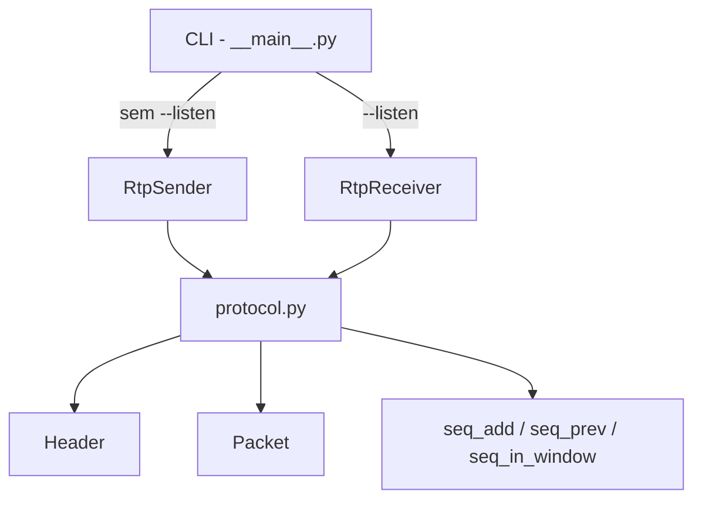

# Architecture

Este documento descreve como a implementacao do RTP funciona internamente.
O foco aqui nao e o uso da CLI, e sim a arquitetura do codigo, a separacao de responsabilidades e o fluxo de pacotes durante uma sessao.

## Visao geral

O projeto implementa um protocolo confiavel sobre UDP com tres variantes de retransmissao:

- `saw`: stop-and-wait.
- `gbn`: Go-Back-N.
- `sr`: Selective Repeat.

O binario exposto pela CLI decide se o processo sera sender ou receiver:

- em modo sender, o processo le um arquivo, segmenta em pacotes RTP e controla retransmissoes;
- em modo receiver, o processo recebe pacotes RTP, reconstrói o arquivo e envia ACK/NACK.

Os modulos principais sao:

- `src/rtp/__main__.py`: parse de argumentos e escolha entre sender e receiver.
- `src/rtp/protocol.py`: definicoes do protocolo, header binario, CRC32, empacotamento e helpers de sequencia.
- `src/rtp/peer.py`: maquina de estados de sender e receiver, incluindo handshake, transferencia e encerramento.

## Diagrama de alto nivel

## Responsabilidades por modulo

### `__main__.py`

Esse arquivo e fino por design.
Ele so faz quatro coisas:

1. monta o parser da linha de comando;
2. valida argumentos basicos, como faixa de porta e tamanho de janela;
3. instancia `RtpReceiver` ou `RtpSender`;
4. delega toda a logica de rede para `peer.py`.

Isso mantem a CLI desacoplada da implementacao do protocolo.
Se futuramente voce quiser adicionar logs, interface grafica ou benchmark automatizado, a maior parte da logica continuara reutilizavel.

### `protocol.py`

Esse modulo contem a definicao do protocolo em si.

Ele concentra:

- constantes do protocolo;
- representacao do header RTP;
- serializacao e desserializacao de pacotes;
- calculo e validacao de CRC32;
- helpers para aritmetica modular do espaco de sequencia de 14 bits.

Essa divisao e importante porque `peer.py` nao precisa saber como os bits do header sao arranjados em bytes. Ele so trabalha com objetos `Packet` e `Header`.

### `peer.py`

Esse modulo implementa o comportamento dos dois papeis da sessao:

- `RtpSender`;
- `RtpReceiver`.

Tambem ficam aqui:

- criacao de sockets UDP;
- loop de handshake;
- algoritmos de transferencia por modo;
- encerramento com `FIN`;
- estatisticas simples da transferencia.

Em outras palavras, `protocol.py` define o formato e `peer.py` define o comportamento.

## Header RTP

O header tem 9 bytes, organizados em um inteiro de 72 bits serializado em big-endian.

Campos implementados:

- `SEQ` com 14 bits;
- `SYN` com 1 bit;
- `FIN` com 1 bit;
- `ACK` com 14 bits;
- `ACK flag` com 1 bit;
- `NACK` com 1 bit;
- `Length` com 8 bits;
- `CRC32` com 32 bits.

Na implementacao, isso aparece na classe `Header`.

### Como o header e serializado

O metodo `Header.pack()` combina todos os campos via operacoes de shift e OR bit a bit.
O inverso acontece em `Header.unpack()`.

Esse desenho tem duas vantagens:

- garante um formato compacto e deterministico;
- deixa explicito o mapeamento entre especificacao e bytes no fio.

## Pacotes e CRC32

A classe `Packet` representa um datagrama RTP completo:

- um `Header`;
- um `payload` opcional.

### Envio

No envio, `Packet.to_bytes()`:

1. valida consistencia entre `header.length` e `payload`;
2. zera o campo `crc32` logicamente usando `replace(self.header, crc32=0)`;
3. calcula o CRC32 sobre `header_sem_crc + payload`;
4. grava o checksum no header final;
5. concatena `header + payload`.

### Recepcao

Na recepcao, `Packet.parse()`:

1. checa se o datagrama tem pelo menos 9 bytes;
2. tenta desserializar o header;
3. confere se o tamanho do payload bate com o header;
4. recalcula o CRC32;
5. retorna `None` se o pacote estiver corrompido.

Isso segue a especificacao: pacote com CRC invalido e descartado silenciosamente.
Nao ha envio de NACK porque o proprio header pode estar corrompido.

## Espaco de sequencia

O espaco de sequencia tem 14 bits, logo o range e `0..16383`.
Por isso `protocol.py` define `MAX_SEQUENCE = 1 << 14`.

Os helpers usados sao:

- `seq_add(seq, increment)`: soma modular;
- `seq_prev(seq)`: pacote anterior no anel;
- `seq_distance(seq, start)`: distancia modular;
- `seq_in_window(seq, start, size)`: verifica se um `seq` esta na janela;
- `seq_is_recent(seq, current, size)`: verifica se o pacote pertence ao passado recente.

Essas funcoes evitam espalhar aritmetica modular por `peer.py`, o que reduziria a legibilidade e aumentaria a chance de erro em wrap-around.

## Segmentacao do arquivo

O sender nunca manda o arquivo inteiro de uma vez.
Ele chama `build_data_packets(data)` para transformar os bytes em uma lista de `Packet`.

Regras aplicadas:

- cada payload normal tem ate `255` bytes;
- se o ultimo fragmento tiver menos de `255`, ele marca o fim do stream naturalmente;
- se o arquivo for multiplo exato de `255`, um pacote final com `length = 0` e emitido para sinalizar o fim sem payload residual;
- se o arquivo for vazio, tambem existe um pacote final de tamanho zero.

Isso implementa diretamente a semantica do campo `Length` na especificacao.

## Sessao: por que existem `data_socket` e `control_socket`

Essa e a parte mais importante para entender a arquitetura.

### Intencao logica

O protocolo e half-duplex para dados:

- um lado envia dados;
- o outro lado responde apenas com controle.

Na implementacao, isso e refletido em dois canais logicos:

- canal de dados;
- canal de controle.

Por isso o sender possui dois sockets locais:

- `data_socket`: usado para enviar `SYN`, dados e `FIN`;
- `control_socket`: usado para receber `ACK`, `NACK` e `FIN+ACK`.

### Por que isso existe

Sem essa separacao, ficaria mais dificil modelar o comportamento pedido pela especificacao, em especial a ideia de que o sender passa a “escutar ACKs” em uma porta dedicada apos o handshake.

Em termos arquiteturais, essa divisao tem tres beneficios:

- separa claramente trafego de dados de trafego de controle;
- simplifica a leitura da maquina de estados do sender;
- deixa a implementacao preparada para os modos com janela deslizante, onde varios ACKs/NACKs podem chegar enquanto ainda existem dados em voo.

### Como isso aparece na pratica

No sender:

- `data_socket` envia para `receiver:P`;
- `control_socket` escuta em uma porta local separada;
- o receiver aprende essa porta local indiretamente, usando `peer_control = (sender_ip, sender_port_de_dados + 1)`.

No receiver:

- existe apenas um socket bound na porta `P`;
- esse mesmo socket recebe dados e envia respostas de controle;
- os `ACK`/`NACK` sao enviados para a porta de controle do sender.

Ou seja, a separacao `data/control` e mais forte do lado do sender do que do lado do receiver.

### Caso local na mesma maquina

Quando sender e receiver rodam no mesmo host, ambos nao podem tentar usar a mesma porta local `P` ao mesmo tempo.
Por isso a implementacao atual faz o sender abrir um par local efemero:

- uma porta aleatoria `X` para dados;
- a porta `X+1` para controle.

Isso preserva a ideia do protocolo de ter um canal de controle separado, mas evita colisao local de bind.

Esse detalhe esta em `create_sender_socket_pair()`.

## Handshake

O handshake e implementado por:

- `RtpSender._establish_session()`;
- `RtpReceiver._accept_session()`.

### Passo 1: SYN

O sender envia um pacote com:

- `syn=True`;
- `length=self.window`.

Aqui, `Length` nao significa tamanho de payload. Ele significa janela proposta.

### Passo 2: SYN+ACK

O receiver responde com:

- `syn=True`;
- `ack_flag=True`;
- `length=self.window` do receiver.

### Passo 3: ACK final

O sender confirma o handshake com:

- `ack_flag=True`;
- `ack=0`.

### Janela efetiva

A janela usada na sessao vira:

- `min(janela_sender, janela_receiver)`.

No codigo, isso e armazenado em `Session.window`.

### Retransmissao no handshake

Se uma resposta nao chega dentro de `100 ms`, o lado correspondente retransmite.
Isso e consistente com o restante do protocolo: timeouts sao tratados como perda de controle ou de dados.

## Objeto `Session`

Depois do handshake, o codigo materializa a sessao no dataclass `Session`, que guarda:

- `peer_data`: endereco remoto usado para trafego de dados;
- `peer_control`: endereco remoto usado para trafego de controle;
- `window`: janela negociada.

Esse objeto evita recalcular destinos de envio em varios pontos da implementacao.

## Fluxo do sender

`RtpSender.run()` segue esta sequencia:

1. le o arquivo inteiro em memoria;
2. chama `build_data_packets()`;
3. cria os sockets locais;
4. executa o handshake;
5. escolhe o algoritmo de envio conforme o modo;
6. encerra a sessao com `FIN`;
7. fecha os sockets e finaliza estatisticas.

### Estatisticas

O sender registra em `TransferStats`:

- inicio e fim da sessao;
- datagramas enviados;
- datagramas recebidos;
- retransmissoes.

Hoje essas estatisticas ainda sao basicas. Elas servem como base para evoluir o projeto com logs e benchmarks para o relatorio.

## Fluxo do receiver

`RtpReceiver.run()` faz:

1. bind na porta `P`;
2. espera e aceita o handshake;
3. recebe o stream segundo o modo selecionado;
4. grava o arquivo montado em disco;
5. responde ao `FIN` com `FIN+ACK`.

O receiver processa uma sessao por vez.
Ou seja, ele nao e um servidor multi-cliente concorrente. Isso simplifica bastante a implementacao e esta alinhado ao escopo do trabalho.

## Modo `saw` (stop-and-wait)

### Sender no modo `saw`

Implementado em `RtpSender._send_stop_and_wait()`.

Comportamento:

1. envia exatamente um pacote;
2. espera o `ACK` desse mesmo `SEQ`;
3. se o `ACK` nao vier a tempo, retransmite o mesmo pacote;
4. so passa ao proximo pacote depois da confirmacao.

Esse e o modo mais simples, mas tambem o mais sensivel ao RTT porque existe apenas um pacote em voo.

### Receiver no modo `saw`

Implementado em `RtpReceiver._receive_stop_and_wait()`.

Comportamento:

1. mantem `expected`, o proximo `SEQ` esperado;
2. se chega exatamente `expected`, agrega o payload ao buffer e responde `ACK(seq)`;
3. se chega o pacote imediatamente anterior, reenviar o `ACK` correspondente ajuda a recuperar `ACK` perdido;
4. pacotes fora de ordem diferentes disso sao ignorados.

## Modo `gbn` (Go-Back-N)

### Sender no modo `gbn`

Implementado em `RtpSender._send_go_back_n()`.

Estado principal:

- `base`: primeiro pacote ainda nao confirmado;
- `next_to_send`: proximo pacote ainda nao colocado em voo.

Comportamento:

1. preenche a janela ate `session.window`;
2. espera um evento de controle;
3. se houver timeout, retransmite tudo de `base` ate `next_to_send - 1`;
4. se houver `NACK`, retransmite do pacote faltante em diante;
5. se houver `ACK`, avanca `base` cumulativamente.

O helper `_find_index()` mapeia o numero de sequencia recebido para o indice da lista local de pacotes em voo.

### Receiver no modo `gbn`

Implementado em `RtpReceiver._receive_go_back_n()`.

Comportamento:

1. aceita apenas o pacote exatamente esperado;
2. ao recebe-lo, faz `ACK(seq)` e avanca `expected`;
3. se recebe pacote duplicado recente, reenvia o ultimo `ACK` cumulativo;
4. se recebe pacote fora de ordem adiante, manda `NACK(expected)`.

Esse desenho segue a semantica classica de GBN: o receiver nao bufferiza lacunas.

## Modo `sr` (Selective Repeat)

### Sender no modo `sr`

Implementado em `RtpSender._send_selective_repeat()`.

Estado principal:

- `base`: menor indice ainda nao completamente confirmado;
- `next_to_send`: proximo indice disponivel para envio inicial;
- `acked`: vetor booleano por pacote;
- `last_sent_at`: instante do ultimo envio de cada pacote.

Comportamento:

1. preenche a janela com novos pacotes;
2. calcula o deadline mais cedo entre pacotes pendentes;
3. processa `ACK`s individuais;
4. processa `NACK`s individuais, retransmitindo so o pacote solicitado;
5. verifica timeout por pacote e retransmite apenas os expirados;
6. avanca `base` enquanto os pacotes iniciais da janela ja estiverem confirmados.

Essa e a principal diferenca em relacao a GBN: em SR, perda de um pacote nao obriga retransmitir todo o resto da janela.

### Receiver no modo `sr`

Implementado em `RtpReceiver._receive_selective_repeat()`.

Estado principal:

- `base`: menor `SEQ` ainda nao entregue em ordem;
- `buffered`: dicionario de pacotes fora de ordem ja aceitos.

Comportamento:

1. se o pacote esta dentro da janela, ele pode ser aceito mesmo fora de ordem;
2. o receiver envia `ACK(seq)` para cada pacote valido recebido;
3. se detecta um buraco, envia `NACK(base)` para pedir o primeiro faltante;
4. assim que o faltante chega, drena os pacotes consecutivos ja bufferizados em ordem.

Esse buffering e exatamente o que faz SR divergir de GBN em cenarios com reordenacao.

## Timeout e retransmissao

O timeout fixo da implementacao e `100 ms`, representado por `TIMEOUT_SECONDS = 0.1`.

Esse valor e usado em tres contextos:

- handshake;
- espera por controle no sender;
- encerramento com `FIN`.

Arquiteturalmente, o sender concentra a responsabilidade de retransmitir.
O receiver apenas sinaliza o estado observado com `ACK` e `NACK`.

## Encerramento da sessao

Depois que todos os dados foram confirmados, o sender executa `_close_session()`:

1. envia `FIN`;
2. espera `FIN+ACK` no canal de controle;
3. se nao vier resposta, retransmite o `FIN`.

No receiver, cada modo de recepcao termina quando recebe `FIN`.
Nesse momento ele:

1. envia `FIN+ACK`;
2. retorna os bytes montados para `run()`;
3. grava o arquivo final.

## Por que a arquitetura esta dividida desse jeito

Ha tres decisoes centrais no desenho atual.

### 1. Separar formato de protocolo da maquina de estados

`protocol.py` cuida de bits, CRC e wrap-around.
`peer.py` cuida de rede e comportamento.

Isso reduz acoplamento e facilita testes unitarios.

### 2. Separar sender e receiver em classes diferentes

Mesmo que compartilhem o mesmo header, os papeis sao bem diferentes:

- o sender retransmite e controla janela;
- o receiver valida ordem, monta buffer e responde controle.

Juntar tudo em uma unica classe tornaria os fluxos mais confusos.

### 3. Tornar o canal de controle explicito

O protocolo conceitualmente separa dados de controle.
Modelar isso no codigo deixa mais claro:

- onde o sender espera `ACK`;
- onde o receiver envia `NACK`;
- por que existe uma porta local adicional no sender.

## Limitacoes atuais

O codigo esta funcional para o escopo do trabalho, mas tem limitacoes importantes:

- processa uma sessao por processo;
- carrega o arquivo inteiro em memoria no sender antes de segmentar;
- nao persiste logs detalhados de eventos por pacote;
- nao possui ferramenta interna para capturas, throughput ou cenarios automatizados de latencia/perda/reordenacao;
- o mapeamento entre `SEQ` e indice local usa busca linear em `_find_index()`, suficiente para janelas pequenas, mas nao ideal para escalabilidade.

## Leitura sugerida do codigo

Se voce quiser entender o projeto na pratica, a melhor ordem de leitura e:

1. `src/rtp/__main__.py` para ver as entradas do programa;
2. `src/rtp/protocol.py` para entender o formato do pacote;
3. `RtpSender.run()` em `src/rtp/peer.py` para acompanhar o lado ativo da sessao;
4. `RtpReceiver.run()` em `src/rtp/peer.py` para acompanhar o lado passivo;
5. os metodos `_send_*` e `_receive_*` para comparar `saw`, `gbn` e `sr`.

Essa ordem funciona bem porque segue o mesmo caminho mental do protocolo: entrada, formato, envio, recepcao e variacoes de confiabilidade.
